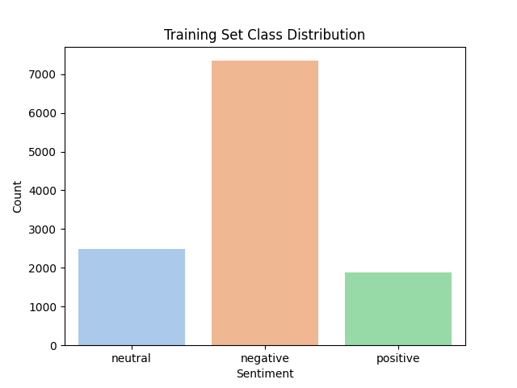
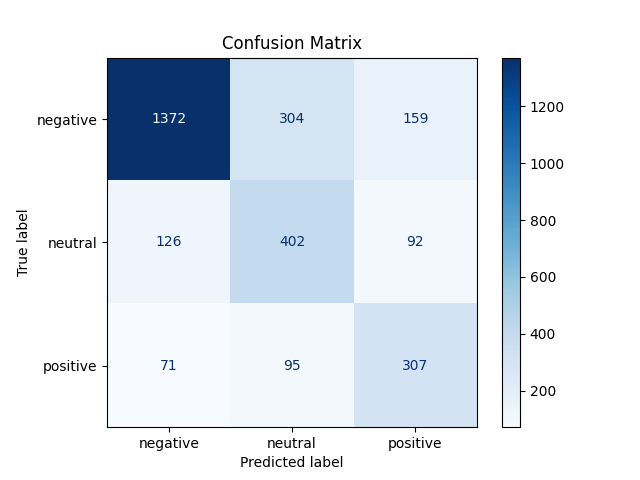
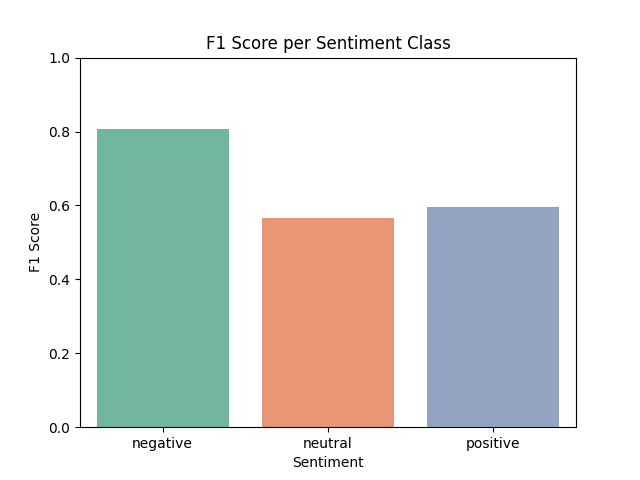

# ✈️ Twitter Airline Sentiment Analysis

## 📌 Overview

This project performs multiclass sentiment classification on airline-related tweets using:
- TF-IDF vectorization and dimensionality reduction (Truncated SVD)
- Logistic Regression with class balancing (`class_weight="balanced"`)
- Feature selection using `SelectFromModel` (L1-based)
- Modular, production-style project structure

## 📁 Project Structure

```bash
.
├── notebooks/               # Jupyter notebooks (main analysis)
│   └── sen_sis.ipynb
├── src/                     # Python scripts for modular code
│   ├── features/            # Feature engineering and processing
│   ├── models/              # Model training and evaluation
│   └── utils/               # Metrics and plotting utilities
├── data/                    # Data storage
│   ├── raw/                 # Original data
│   └── processed/           # Cleaned or transformed data
├── results/                 # Output results
│   ├── figures/             # PNG plots (confusion matrix, F1, etc.)
│   └── reports/             # Metrics in .json or .txt format
└── README.md
```

## 📊 Dataset

- Total samples: 14,600 tweets
- Features: tweet text, airline, location, time, etc.
- Target: sentiment (positive, neutral, negative)

## 🪈 Pipeline Overview

```text
Raw Data → Preprocessing → TF-IDF → TruncatedSVD → Scaling + Encoding →
Feature Selection → Logistic Regression (with class_weight='balanced')
```

## 🧠 Key Considerations

- Class imbalance was addressed using class weights
- Feature dimensionality reduced using SVD (100 components)
- GridSearchCV was **skipped** due to very long runtime (>10 hours)
- Logistic Regression was manually tuned with regularization and solvers

## 📈 Evaluation Results

This section summarizes performance of the final Logistic Regression model.

### 📉 Class Distribution

Class imbalance was mitigated using `class_weight='balanced'`.



### 📊 Confusion Matrix

Shows where the model made correct vs incorrect predictions across the sentiment classes.



###  F1 Scores by Class

Shows a better sense of performance per class (especially minority classes).



### ❗Feature Importance

Since Truncated SVD was used to reduce dimensionality from thousands of TF-IDF features to just 100 components, direct feature importance (e.g., word weights) is very complex for interpretation. Therefore no visual showing feature importance is done.

This choice was made to improve runtime and reduce overfitting risk on sparse input.

### 📋 Classification Report

Full precision, recall, and F1 for each class as well as other metrics:

📄 `results/reports/classification_report.txt`

### 📊 Summary Metrics

Accuracy, macro-F1, and weighted-F1:

📄 `results/reports/metrics.json`

## ⏭️ Future Work

- Add more models: LinearSVC, XGBoost for comparison
- Perform model validation for better models (Runtime too long for slow model)
- Use SelectFromModel inside pipeline with GridSearch
- Improve emoji and punctuation normalization on text preprocessing
- Optimize runtime with model selection strategies


## 🛠️ Utilities

Plots and metrics are saved using modular utility scripts:

- `src/utils/metrics.py` – saves classification reports and metric scores
- `src/utils/plots.py` – saves confusion matrix, F1 scores, etc.

These scripts support reuse across different classifiers.

---

🚀 Built for modularity, performance, and GitHub clarity.